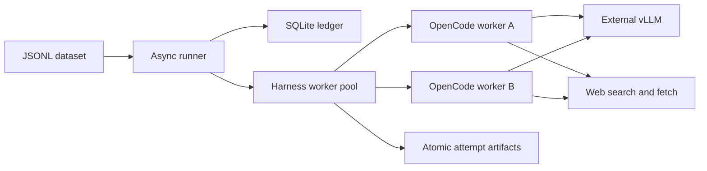
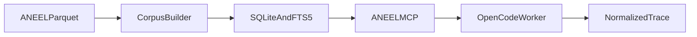

# Architecture

## Boundaries

The runner owns dataset selection, concurrency, retries, persistence, and
normalized results. Harness adapters own native process lifecycle, permissions,
sessions, events, cancellation, and answer extraction. Model endpoints and
task prompts are separate configuration objects.

## Worker isolation

Each managed worker has its own OpenCode server process, local authenticated
HTTP endpoint, configuration, XDG directories, empty workspace, and log. A
worker executes one case at a time. Every case gets a new OpenCode session.
Workers are reused to avoid startup overhead, but are restarted after
infrastructure failures.

The initial policy denies every tool and then allows only `websearch` and
`webfetch`. Shell, writes, repository reads, globbing, and grep are explicitly
denied. Web content is still untrusted and can contain prompt injection, so the
shared task prompt tells the model to treat it only as evidence.

## Closed-corpus environments

`RunSpec.environment` selects either the default live-web environment or a
local corpus. The ANEEL corpus is built offline from pinned Parquet shards into
a read-only SQLite metadata table and FTS5 index. Each OpenCode worker starts
the same local MCP server command against that immutable database:

Corpus runs invert the web policy: web, shell, repository reads, and writes
remain denied while only MCP tools prefixed `aneel_` are allowed. The adapter
counts distinct tool-call IDs and fails the attempt after the configured limit.
Document IDs observed in tool payloads are retained as result provenance.

The ANEEL MCP server generates three operations for every registered document
family: `search_<family>`, `get_<family>`, and `list_<family>`. The family is
bound by the server rather than supplied by the model. With 29 families and
three shared tools (`get_aneel_document`, `get_aneel_corpus_stats`, `finish`),
the model sees 90 tools. The explicit split makes family selection measurable,
at the cost of a larger tool schema and harder routing for small models.

Run manifests copy the small corpus build manifest and its hash, not the
multi-gigabyte database. Resume rejects a changed corpus manifest.

## Preferred source profiles

Source profiles are task configuration, not harness skills. The runner renders
the same guidance for OpenCode and future harnesses, preserving comparison
fairness. Preferred mode asks the agent to search trusted locations first but
does not block broader web research.

The ANEEL profile provides:

- Official domains, including path-scoped `www.gov.br/aneel`.
- An always-included ANEEL open-data organization page used for discovery.
- Topic-specific seed pages selected through dataset `tags`.
- Research instructions for ambiguous Brazilian electrical-sector terms,
  primary regulations, amendments, and current status.

Qualification uses a separate domain-neutral prompt. It therefore tests web
tool behavior without requiring ANEEL sources to answer an unrelated probe.

After execution, the runner classifies captured URLs against the resolved
profile. `source_matches` and export-level preferred-source counts are
provenance metadata, not answer-quality scores.

## Run lifecycle

1. Load and validate configuration and JSONL records.
2. Snapshot the dataset, optional source profile and their SHA-256 hashes plus
   the redacted resolved config.
3. Qualify the OpenCode version, vLLM model discovery, SSE lifecycle, and one
   real web-tool case.
4. Start the bounded worker pool and assign one case per worker.
5. Stream each attempt to its own temporary trace file.
6. Atomically publish trace and result files, then commit ledger state.
7. Retry only infrastructure failures, preserving every attempt.
8. Resume by selecting unfinished ledger cases after verifying the dataset hash.

## Failure taxonomy

- `qualification_failure`: preflight could not prove the stack works.
- `timeout`: the external case deadline elapsed.
- `harness_crash`: OpenCode, HTTP/SSE, or worker lifecycle failed.
- `model_error`: the provider returned a model/request error.
- `malformed_tool_call`: a tool call could not be decoded or dispatched.
- `web_tool_failure`: search or fetch failed terminally.
- `missing_answer`: the session became idle without assistant text.
- `cancellation`: operator or runner cancellation.
- `success`: idle completion with a captured plain final answer.

Adapters should improve native error mapping as harness event schemas evolve.
Exit status alone is never treated as proof of success.

## Reproducibility

The run manifest records the dataset hash, resolved prompt and policy, model
endpoint metadata, concurrency, deadlines, source configuration, and redacted
secrets. Pin OpenCode in deployment and set `harness.version`; `doctor` rejects
a different version. vLLM should expose a stable served model ID and use the
model-specific tool-call parser.

Live web search is inherently nondeterministic. A future deterministic suite
can implement a recorded MCP search backend without changing runner contracts.

## Adding a harness

1. Implement `HarnessAdapter` and `HarnessWorker` from
   `src/agentic_eval/harnesses/base.py`.
2. Keep native events and permissions inside the adapter.
3. Return `AttemptResult` and emit normalized `TraceEvent` values.
4. Advertise capabilities honestly; the runner must reject unsupported task
   requirements during qualification.
5. Register the adapter in `harnesses/registry.py`.
6. Run the shared adapter contract tests plus native lifecycle tests.

`claude_code.py` and `codex.py` reserve the next extension points without
pretending those integrations already exist.

## Harness research

The runner contract is `HarnessAdapter` / `HarnessWorker` in
[`src/agentic_eval/harnesses/base.py`](../src/agentic_eval/harnesses/base.py).
Adapters own native process lifecycle, permissions, sessions, events,
cancellation, and answer extraction. Model endpoints and task prompts
remain separate configuration objects.

Comparable research notes, each using the same section order:

- [OpenCode 1.18.21](harness-opencode.md): implemented adapter; most
  model-portable of the three. Task `system_prompt` currently reaches
  OpenCode as user-role text.
- [Codex CLI](harness-codex.md): provider-pluggable, Responses-oriented,
  not protocol-neutral. Reserved, not implemented.
- [Claude Code](harness-claude-code.md): Claude-only proprietary loop.
  Reserved as a Claude-specific baseline, not a shared adapter.

Use those notes when designing a fourth, model-agnostic harness: keep
native prompt layers, compaction, tool inventory, and permission
semantics inside the adapter, and return only `AttemptResult` plus
normalized `TraceEvent` values.
